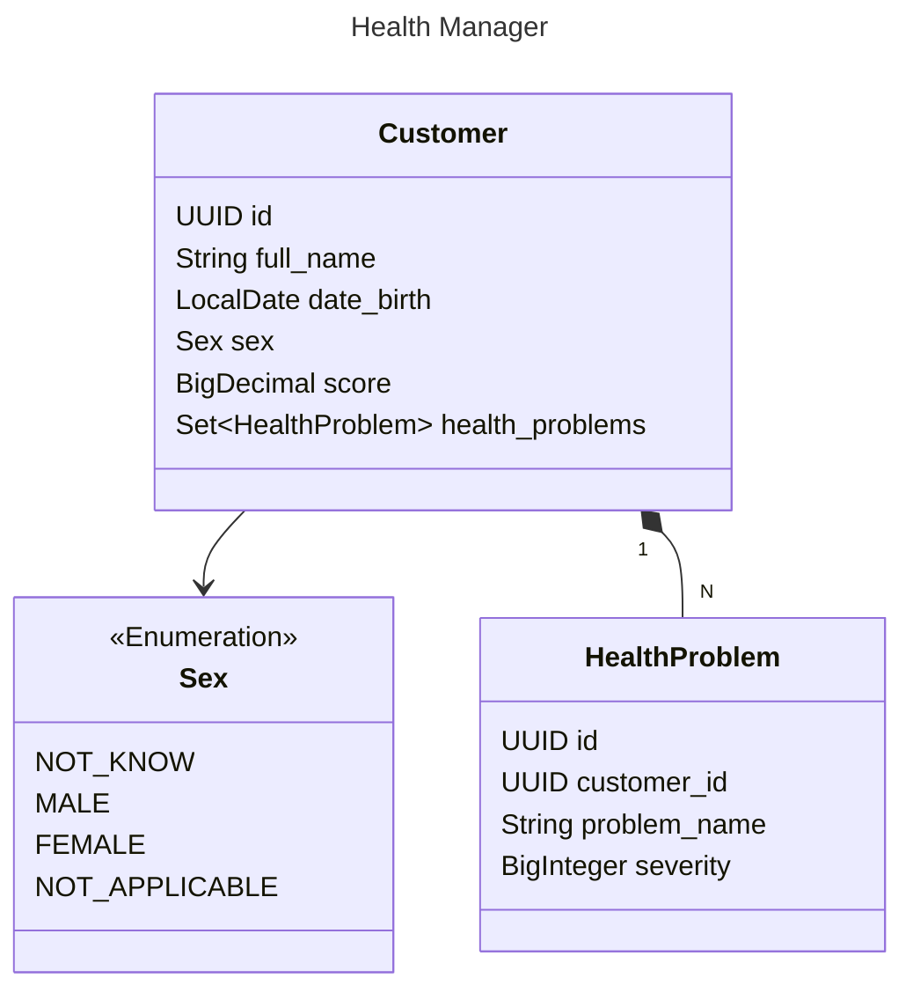

<h1 align="center">Health Manager</h1>

### Description

<p align="center justify">
This repository is a backend technical test, where a health management API was developed.
</p>

#### Tech Stack

    Java@17, Spring Boot@3.2, H2 Database

#### Class Diagram (Main responses)



### Running the app

**Prerequisites:**

-  Java version 17 or higher (Check your version: `java -version`)
-  Maven version 3 or higher (Check your version: `mvn -v`)

**Commands**

```bash
cd backend
mvn package
java -jar ./target/healthmanager-0.0.1-SNAPSHOT.jar
```

*If you don't have maven installed*
- Download jar in [releases](https://github.com/wesleybritovlk/health-manager/releases)
- Run command `java -jar healthmanager.jar`


**That's it! Now you can access the app:**

- **home:** `http://localhost:8080/api`
- **documentation:** `http://localhost:8080/api/swagger-ui.html`
